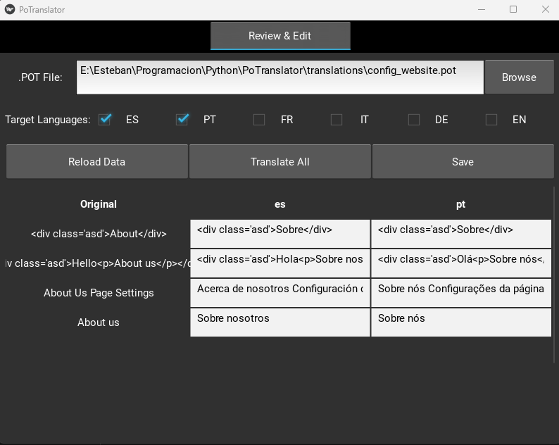

# Poder

### Traducción de lectura

-   [Inglés](README.md)
-   [Español](README.es.md)
-   [portugués](README.pt.md)
-   [Francés](README.fr.md)

### GUI POTRANSLATOR - Cómo usar

## Descripción general

Potranslator GUI es una aplicación fácil de usar para traducir y administrar archivos .pot/.po. Le permite traducir cadenas de texto en múltiples idiomas, revisar las traducciones y guardarlas en archivos .po.

## Empezando

1.  **Iniciar la aplicación**
    -   Ejecute la aplicación para abrir la ventana principal.

2.  **Select a POT File**
    -   Haga clic en "Explorar" para seleccionar su archivo .pot (el archivo de plantilla que contiene cadenas originales).
    -   La aplicación detectará automáticamente las traducciones disponibles en el mismo directorio.

## Características principales

### Gestión de traducción

-   **Seleccionar idiomas de destino**: Marque las casillas de los idiomas que desea traducir a (español, portugués, francés, italiano, alemán, inglés).
-   **Traducir todo**: Haga clic en "Traducir todo" para traducir automáticamente todos los idiomas seleccionados a la vez.
-   **Editar traducciones**: Haga doble clic en cualquier celda de traducción para editarla manualmente.

### Revisar y editar

-   Ver todas las cuerdas originales y sus traducciones una al lado de la otra.
-   La tabla muestra:
    -   Texto original (desde el archivo .pot)
    -   Texto traducido para cada idioma seleccionado
-   Hacer cambios directamente en la tabla.

### Salvando las traducciones

-   Haga clic en "Guardar" para guardar todas las traducciones a sus respectivos archivos .po.
-   Las traducciones se guardan en el mismo directorio que su archivo .pot.

### Ajustes

-   Ajuste el tamaño de lotes para las operaciones de traducción (cuántas cadenas se procesan a la vez).
-   Elija si se debe guardar archivos en el directorio de archivos de Pot o en una carpeta de traducciones separadas.

## Consejos

-   Siempre revise las traducciones automáticas antes de ahorrar.
-   La aplicación conserva todos los metadatos existentes (comentarios, banderas) al guardar archivos .po.
-   Use el botón "Recargar datos" si realiza cambios en los archivos fuera de la aplicación.
-   Nuestra aplicación separa con éxito los especificadores de formato (como %S, %D, %F) y etiquetas HTML/XML durante los procesos de traducción, lo que permite el manejo de texto puro sin comprometer elementos estructurales.
