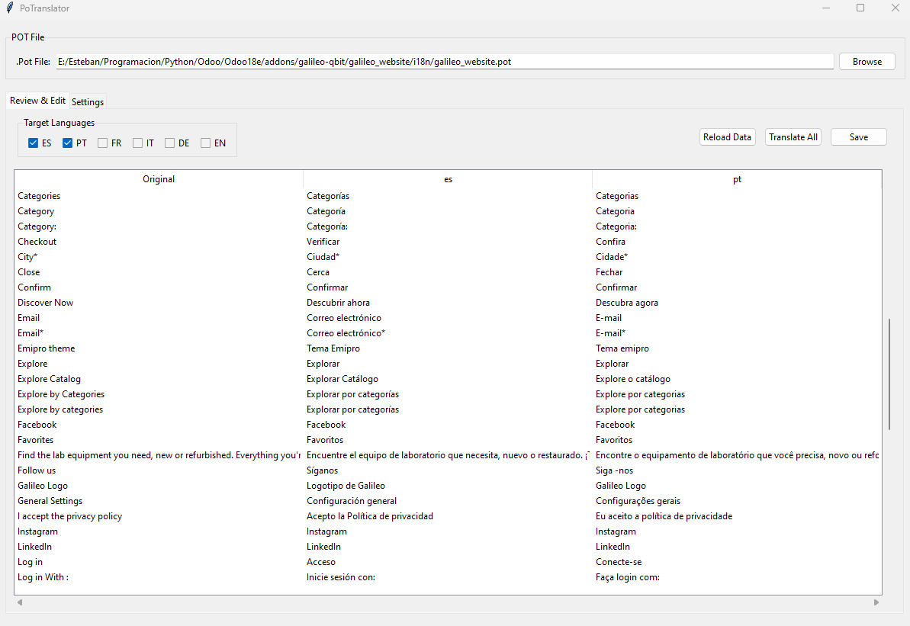

# Pode

### Readme Tradução

-   [Inglês](README.md)
-   [Espanhol](README.es.md)
-   [Português](README.pt.md)
-   [Francês](README.fr.md)

### Potranslator GUI - Como usar

## Visão geral

A Potranslator GUI é um aplicativo fácil de usar para traduzir e gerenciar arquivos .POT/.PO. Ele permite que você traduz seqüências de texto em vários idiomas, revise as traduções e salve -as de volta aos arquivos .PO.

## Começando

1.  **Inicie o aplicativo**
    -   Execute o aplicativo para abrir a janela principal.

2.  **Selecione um arquivo de maconha**
    -   Clique em "Procurar" para selecionar seu arquivo .pot (o arquivo de modelo que contém strings originais).
    -   O aplicativo detectará automaticamente as traduções disponíveis no mesmo diretório.

## Principais características

### Gerenciamento de tradução

-   **Selecione os idiomas de destino**: Verifique as caixas para os idiomas para os quais você deseja traduzir (espanhol, português, francês, italiano, alemão, inglês).
-   **Traduzir tudo**: Click "Translate All" to automatically translate all selected languages at once.
-   **Editar traduções**: Clique duas vezes em qualquer célula de tradução para editá-la manualmente.

### Revisão e edição

-   Veja todas as cordas originais e suas traduções lado a lado.
-   A tabela mostra:
    -   Texto original (do arquivo .pot)
    -   Texto traduzido para cada idioma selecionado
-   Faça alterações diretamente na tabela.

### Salvando traduções

-   Clique em "Salvar" para salvar todas as traduções em seus respectivos arquivos .PO.
-   As traduções são salvas no mesmo diretório que o seu arquivo .pot.

### Configurações

-   Ajuste o tamanho do lote para operações de tradução (quantas strings são processadas de uma só vez).
-   Escolha se deve salvar arquivos no diretório do arquivo de maconha ou em uma pasta de traduções separada.

## Pontas

-   Sempre revise as traduções automáticas antes de salvar.
-   O aplicativo preserva todos os metadados existentes (comentários, sinalizadores) ao salvar arquivos .PO.
-   Use o botão "Reload Data" se fizer alterações nos arquivos fora do aplicativo.
